МИНИСТЕРСТВО НАУКИ  И ВЫСШЕГО ОБРАЗОВАНИЯ РОССИЙСКОЙ ФЕДЕРАЦИИ  
Федеральное государственное автономное образовательное учреждение высшего образования  
"КРЫМСКИЙ ФЕДЕРАЛЬНЫЙ УНИВЕРСИТЕТ им. В. И. ВЕРНАДСКОГО"  
ФИЗИКО-ТЕХНИЧЕСКИЙ ИНСТИТУТ  
Кафедра компьютерной инженерии и моделирования
  
​
### Отчёт по лабораторной работе № 1  по дисциплине "Программирование"
 
​
студента 1 курса группы ПИ-б-о-191(1)  
Федорова Артема Александровича  
направления подготовки 09.03.04 "Программная инженерия"  
 
​
<table>
<tr><td>Научный руководитель  старший преподаватель кафедры  компьютерной инженерии и моделирования</td>
<td>(оценка)</td>
<td>Чабанов В.В.</td>
</tr>
</table>
  
​
Симферополь, 2019

Лабораторная работа №1

Цель: изучить основные возможности создания и отладки программ в IDE MS Visual Studio.

Ход работы

Ответить на вопросы. Ответы поместить в отчёт.
Каждый ответ должен содержать текстовое описание требуемых действий и скриншоты демонстрирующие эти действия

1.Как создать консольное приложение С++?

Нажать на вкладку "Файл" в верхнем меню VS , затем перейдите во вкладку "Создать" и выберите "Проект..." . 
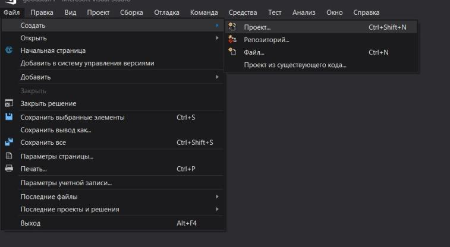

<em>Скрин 1.Как создать консольное приложение С++</em>

В появившемся окне выберите вкладку "Visual C++" далее "Консольное приложение Windows", задайте имя проекта и кликните "Ок"
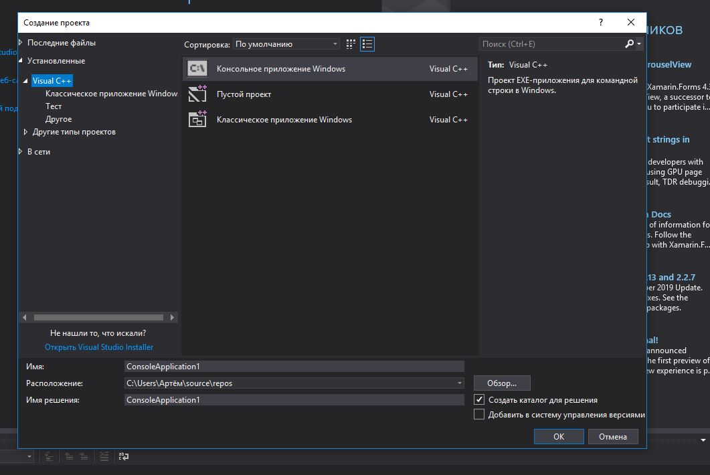

<em>Скрин 2.Как создать консольное приложение С++</em>

2.Как изменить цветовую схему (оформление) среды?

Перейти на вкладку "Средства" , затем на "Параметры..."
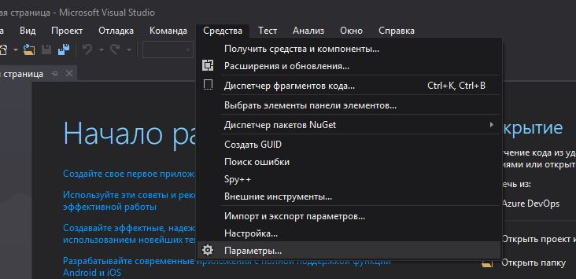

<em>Скрин 3.Как изменить цветовую схему (оформление) среды</em>

Далее выберите слева вкладку "Окружение" и справа появится "Цветовая тема"
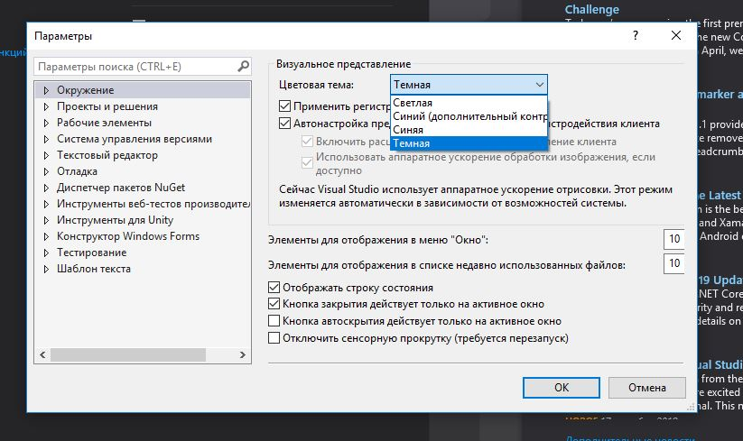

<em>Скрин 4.Как изменить цветовую схему (оформление) среды</em>

3.Как закомментировать/раскомментировать блок кода средствами VS?

На верхней панели VS есть 2 кнопки отвечающие за комментирование/раскомментирование выделенной области(см. Скриншоты)
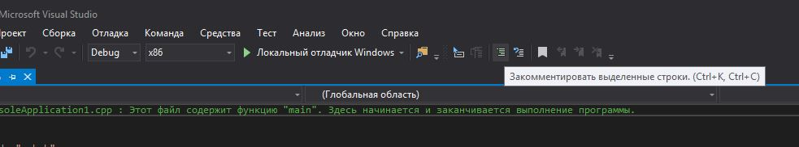

<em>Скрин 5.Как закомментировать блок кода средствами VS?</em>

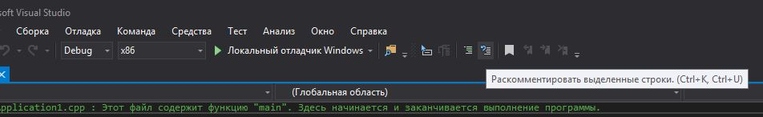

<em>Скрин 6.Как раскомментировать блок кода средствами VS</em>

4.Как открыть в проводнике Windows папку с проектом средствами VS?

В Обозреватели решений нажать ПКМ на ваш проект и выбрать "Показать папку в проводнике" (Обозреватель решений находится справа в основной среде VS)
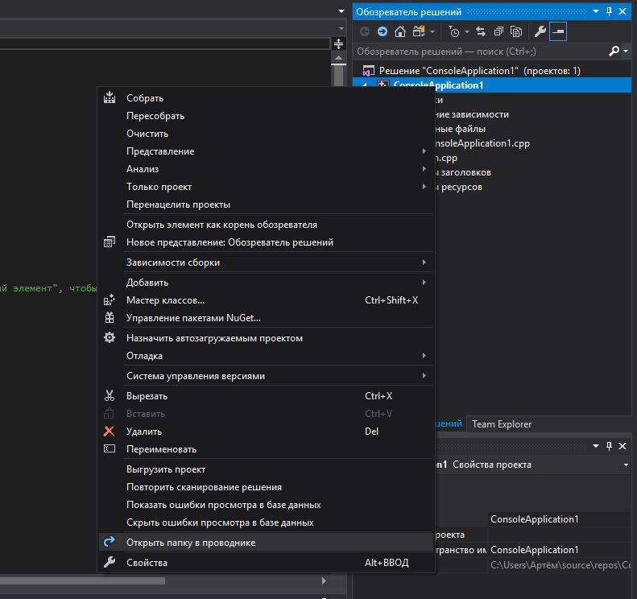

<em>Скрин 7.Как открыть в проводнике Windows папку с проектом средствами VS</em>

5.Какое расширение файла-проекта используется в VS?

.sln

6.Как запустить код без отладки (не менее 2 способов)?

Способ №1

Нажать на вкладку "Отладка" и выбрать "Запуск без отладки"
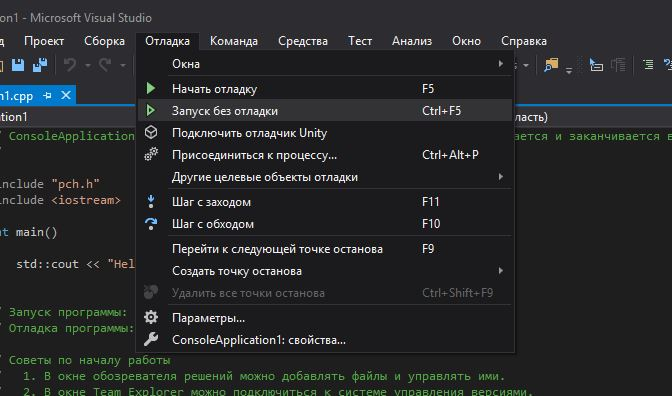

<em>Скрин 8.Как запустить код без отладки (способ 1)</em>

Способ №2

Сочетанием клавиш Ctrl+F5

7.Как запустить код в режиме отладки (не менее 2 способов)?

Способ №1

Нажать на F5

Способ №2

Нажать на вкладку "Отладка" и выбрать "Начать отладку"
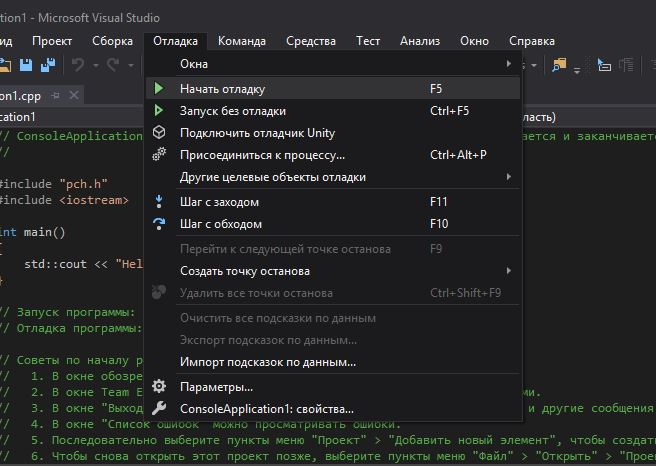

<em>Скрин 9.Как запустить код в режиме отладки (способ 2)</em>

8.Как установить/убрать точку останова (breakpoint)?

Кликнуть ПКМ по строке в которой нужно поставить breakpoint и выбрать "Точка останова" и нажать "Вставить точку останова"
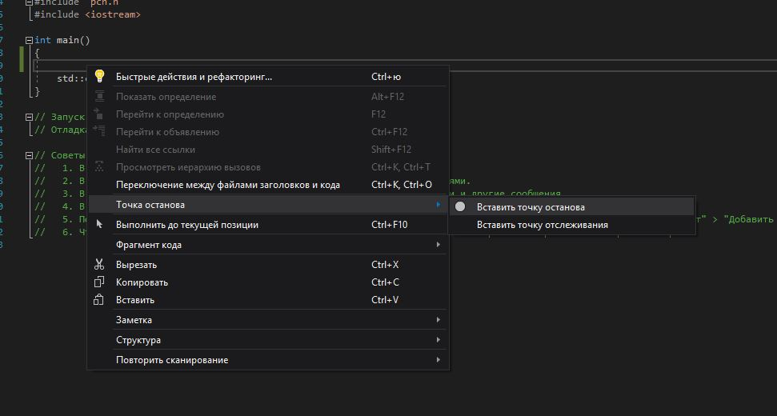

<em>Скрин 10.Как установить точку останова (breakpoint)</em>

Для удаления кликунть ПКМ по той строке в которой находится breakpoint и выбрать "Точка останова" и нажать "Удалить точку останова"
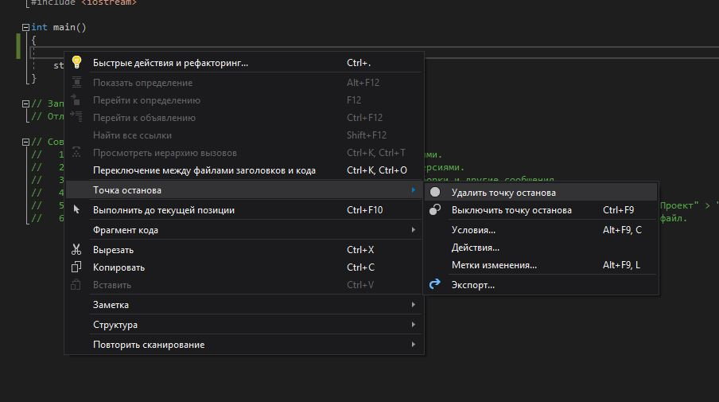

<em>Скрин 11.Как удалить точку останова (breakpoint)</em>

9.Создать программу со следующим кодом,перейти в debug и установить breakpoint

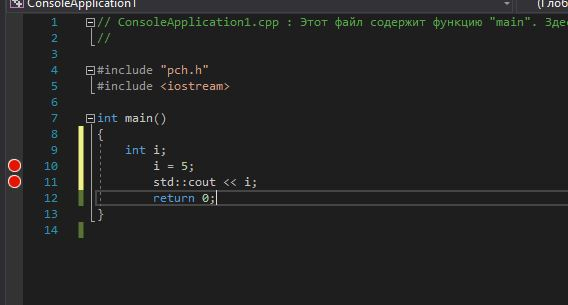

<em>Скрин 12.Программа по заданию №9</em>

При выполнении программы на строке 10 i принимает значение -858993460 , а при нажатии "Продолжить" в строке 11 переменная i принмает занчение 5

10.В том же коде поменять тип i на double?

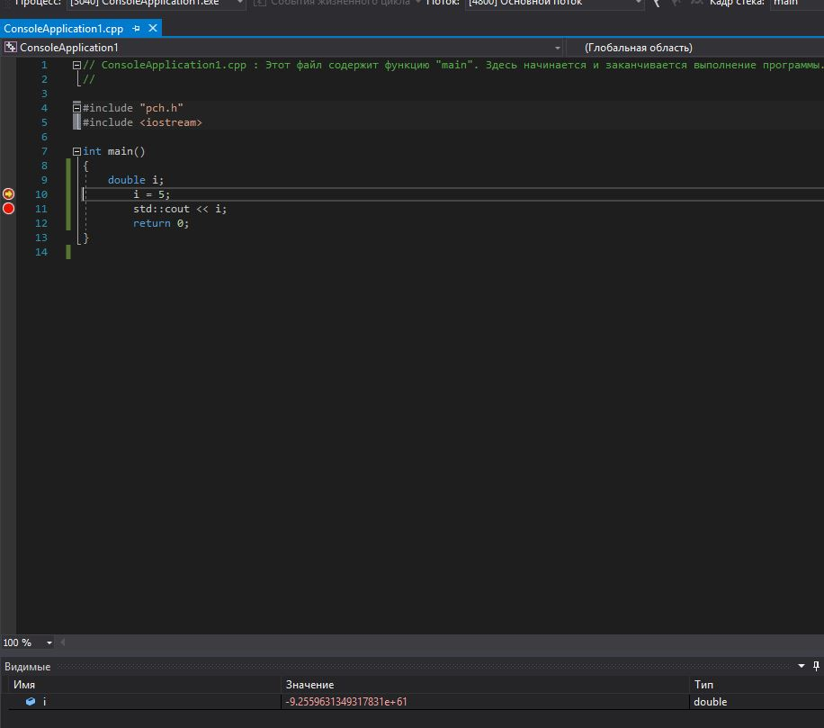

<em>Скрин 13.Программа по заданию №10</em>

При выполнении программы на строке 10 i принимает значение -9.2559631349317831e+61 , а при нажатии "Продолжить" в строке 11 переменная i принмает занчение 5.0000000000000000

<h2><b>Вывод:</b></h2> Изучил основные возможности создания и отладки программ в IDE MS Visual Studio ,подкрепил знания на практике , научился описывать свои действия.

