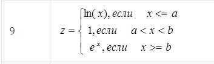
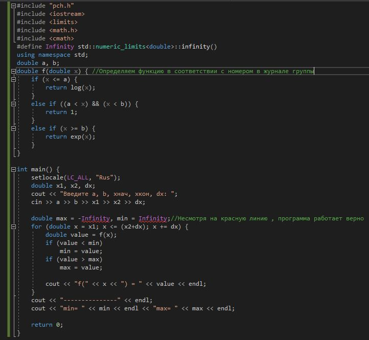
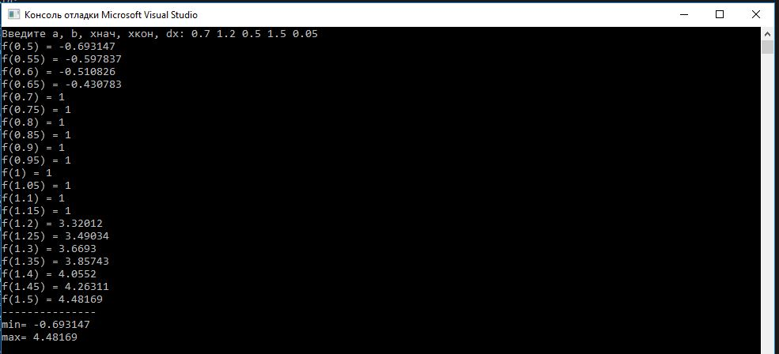
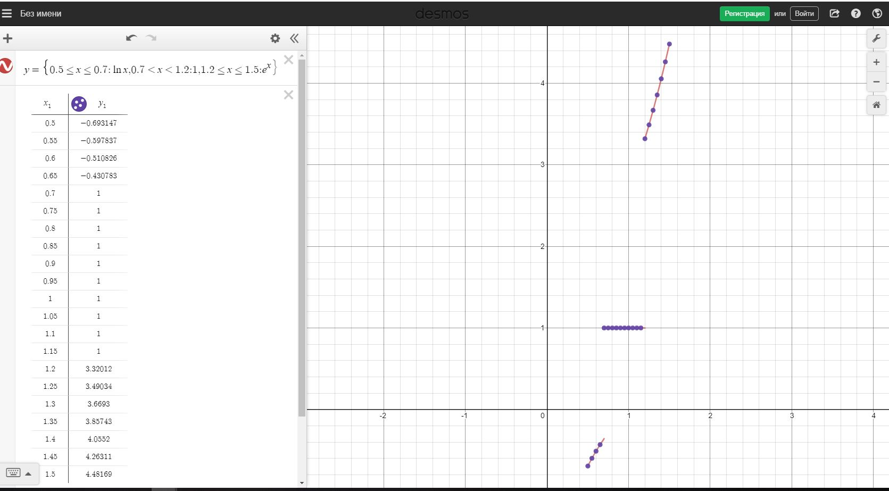
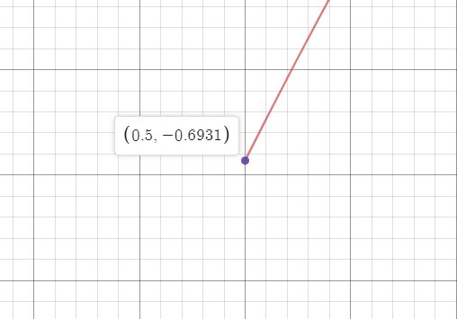

МИНИСТЕРСТВО НАУКИ  И ВЫСШЕГО ОБРАЗОВАНИЯ РОССИЙСКОЙ ФЕДЕРАЦИИ  
Федеральное государственное автономное образовательное учреждение высшего образования  
"КРЫМСКИЙ ФЕДЕРАЛЬНЫЙ УНИВЕРСИТЕТ им. В. И. ВЕРНАДСКОГО"  
ФИЗИКО-ТЕХНИЧЕСКИЙ ИНСТИТУТ  
Кафедра компьютерной инженерии и моделирования
  
​
### Отчёт по лабораторной работе № 2  по дисциплине "Программирование"
 
​
студента 1 курса группы ПИ-б-о-191(1)  
Федорова Артема Александровича  
направления подготовки 09.03.04 "Программная инженерия"  
 
​
<table>
<tr><td>Научный руководитель  старший преподаватель кафедры  компьютерной инженерии и моделирования</td>
<td>(оценка)</td>
<td>Чабанов В.В.</td>
</tr>
</table>
  
​
Симферополь, 2019

<b>Цель:</b>

1.Сформировать навыков программирования алгоритмов разветвляющейся структуры

2.Овладеть практическими навыками разработки и программирования вычислительного процесса циклической структуры

3.Изучить операторы ветвления. Особенности использования полной и сокращенной формы оператора if и тернарного оператора

<h2 align="center"><b>Ход работы</b></h2>

Для начала следует определиться с функцией которую надо анализировать

<i>Скрин1. Функция</i>

Далее следует написать код для определения Min и Max значений функции

<i>Скрин2. Код программы</i>

Смотрим на результат работы программы и определяем минимум и максимум

<i>Скрин3. Результат программы</i>

<b>Max=4.48169</b>

<b>Min=-0.693147</b>

Сверим наш результат с сайтом <a href="https://www.desmos.com/calculator">https://www.desmos.com/calculator</a>

Вот получившийся график на сайте

<i>Скрин4. График в Desmos с точками из программы</i>

Максимум

<i>Скрин5. Макс. значение функции</i>

Минимум

<i>Скрин6. Мин. значение функции</i>

Значения из программы совпали со значениями полученными на сайте , а значит программа написана верно

<h2><b>Вывод</b></h2>

Овладел практическими навыками разработки и программирования вычислительного процесса циклической структуры.
Сформировал навыкои программирования алгоритмов разветвляющейся структуры.
Изучил операторы ветвления, Особенности использования полной и сокращенной формы оператора if и тернарного оператора.

