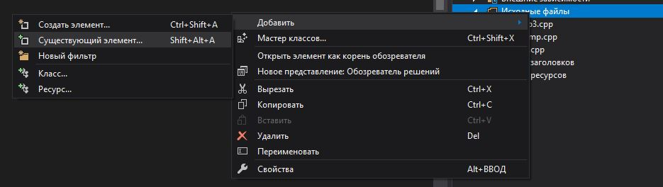
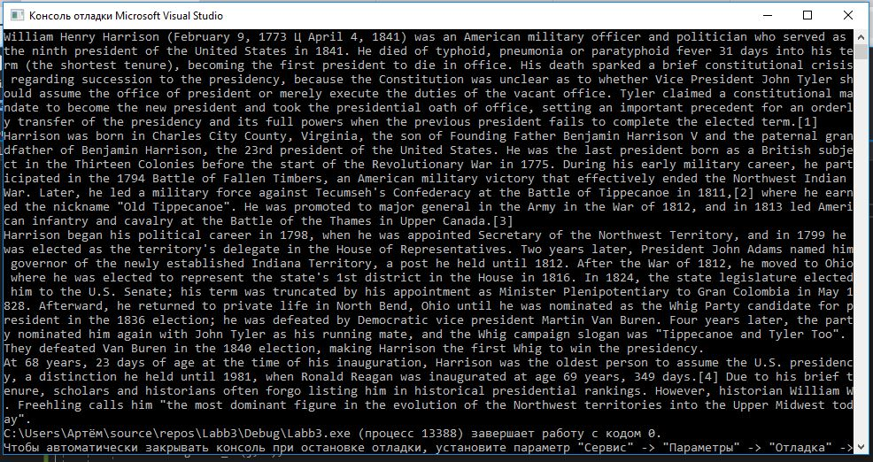

МИНИСТЕРСТВО НАУКИ  И ВЫСШЕГО ОБРАЗОВАНИЯ РОССИЙСКОЙ ФЕДЕРАЦИИ  
Федеральное государственное автономное образовательное учреждение высшего образования  
"КРЫМСКИЙ ФЕДЕРАЛЬНЫЙ УНИВЕРСИТЕТ им. В. И. ВЕРНАДСКОГО"  
ФИЗИКО-ТЕХНИЧЕСКИЙ ИНСТИТУТ  
Кафедра компьютерной инженерии и моделирования
<br/><br/>
​
Отчёт по лабораторной работе № 3<br/> по дисциплине "Программирование"
<br/>
​
студента 1 курса группы ПИ-б-о-191(1)  
Федорова Артема Александровича
направления подготовки 09.03.04 "Программная инженерия"  
<br/>
​
<table>
<tr><td>Научный руководитель<br/> старший преподаватель кафедры<br/> компьютерной инженерии и моделирования</td>
<td>(оценка)</td>
<td>Чабанов В.В.</td>
</tr>
</table>
<br/><br/>
​
Симферополь, 2019

<h2><b>Цель:</b></h2>
<p>1.Закрепить навыки разработки программ использующих операторы цикла;</br>
2.Закрепить навыки разработки программ использующих массивы;</br>
3.Освоить методы подключения сторонних библиотек.</p>
<h2><b>Ход Работы</b></h2>
<p>1.Скачал библиотеку "libbmp" из <a href="https://github.com/marc-q/libbmp">репозитория</a></p>

Рисунок1.Подключение libbmp</br>
​
<p>2.Файл libbmp.cpp скопировал в папку проекта и добавил к проекту</p>
<p></p>
Рисунок2.Ключ к картинке</br>
​
<p>Скачал картинку в соответствии со своим вариантом</p>
Рисунок3.Картинка</br>
​
<p>3.Написал программу для декодирования сообщения из картинки:</p>

```c++
#include "pch.h"
#include "libbmp.h"
#include <iostream>

int main()
{
	BmpImg img;
	img.read("pic9.bmp");
	const int width = img.get_width() - 1;
	const int height = img.get_height() - 1;
	char pix[4000];
	char y = 0;
	int pos = 0;
	int k = 0;
	int bit;
	bool isEnd = false;
	for (int i = height; i >= 0; i--)
	{
		for (int j = width; j >= 0; j--)
		{
			bit = img.blue_at(j, i);
			y = y << 1;
			if (bit % 2 == 1) 
				y++;
			k++;
			if (k == 8) {
				pix[pos] = y;
				pos++;
				k = 0;
				if (y == '\0') {
					isEnd = true;
					break;
				}
			}

			bit = img.green_at(j, i);
			y = y << 1;
			if (bit % 2 == 1)
				y++;
			k++;
			if (k == 8) {
				pix[pos] = y;
				pos++;
				k = 0;
				if (y == '\0') {
					isEnd = true;
					break;
				}
			}

			bit = img.red_at(j, i);
			y = y << 1;
			if (bit % 2 == 1) 
				y++;
			k++;
			if (k == 8) {
				pix[pos] = y;
				pos++;
				k = 0;
				if (y == '\0') {
					isEnd = true;
					break;
				}
			}
			
			
		}
		if (isEnd)	
			break;
	}
	std::cout << pix;
}
```

<p>4.Вот что выдала программа в качестве результата:</p>

Рисунок4.Вывод программы</br>
<h2><b>Вывод:</b></h2>
<p>Закрепить навыки разработки программ использующих операторы цикла. Закрепить навыки разработки программ использующих массивы. Освоить методы подключения сторонних библиотек.</p>
