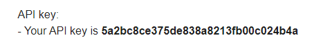
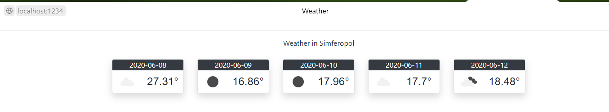

<p align="center">МИНИСТЕРСТВО НАУКИ  И ВЫСШЕГО ОБРАЗОВАНИЯ РОССИЙСКОЙ ФЕДЕРАЦИИ<br>
Федеральное государственное автономное образовательное учреждение высшего образования<br>
"КРЫМСКИЙ ФЕДЕРАЛЬНЫЙ УНИВЕРСИТЕТ им. В. И. ВЕРНАДСКОГО"<br>
ФИЗИКО-ТЕХНИЧЕСКИЙ ИНСТИТУТ<br>
Кафедра компьютерной инженерии и моделирования</p>
<br>
<h3 align="center">Отчёт по лабораторной работе № 6<br> по дисциплине "Программирование"</h3>
<br><br>
<p>студента 1 курса группы ПИ-б-о-191(1)<br>
Федорова Артема Александровича<br>
направления подготовки 09.03.04 "Программная инженерия"</p>
<br><br>
<table>
<tr><td>Научный руководитель<br> старший преподаватель кафедры<br> компьютерной инженерии и моделирования</td>
<td>(оценка)</td>
<td>Чабанов В.В.</td>
</tr>
</table>
<br><br>
<p align="center">Симферополь, 2020</p>
<hr>

<h3>Цель:</h3>
<p>1.Закрепить навыки разработки многофайловыx приложений;<br>
2.Изучить способы работы с API web-сервиса;<br>
3.Изучить процесс сериализации/десериализации данных.</p>

<h3 align="center">Ход работы</h3>
<p>Для начала работы необходимо получить API-ключ.</p>
<p>Мой ключ:</p>

<p align="center"><i>Рис1. Мой API-ключ</i></p>
<p>Полный код программы:</p>

```c++
#include "pch.h"
#include <iostream>
#include <httplib/httplib.h>
#include <nlohmann/json.hpp>

//5a2bc8ce375de838a8213fb00c024b4a - API
//693805 - SIMF
void gen_resp(const httplib::Request& req, httplib::Response& resp)
{
	httplib::Client cli("api.openweathermap.org", 80); //80 - стандартный порт для http-страниц 

	auto responce = cli.Get("/data/2.5/forecast?id=693805&APPID=5a2bc8ce375de838a8213fb00c024b4a&units=metric");
	if (responce && responce->status == 200) //Проверка, удалось ли заргузить страницу
	{
		nlohmann::json res = nlohmann::json::parse(responce->body);
		//std::cout << result["cod"];
		std::ifstream fin("Weather.html");
		std::string output = "Could't load template";

		if (!fin.is_open()) 
		{
			std::cout << "Could't load template" << std::endl;
			fin.close();
		}
		else 
		{
			output = "";
			char ch;
			while (fin.get(ch)) 
			{
				output += ch;
			}

			std::string name = "{city.name}";
			std::string date = "{list.dt}";
			std::string temp = "{list.main.temp}";
			std::string icon = "{list.weather.icon}";
			std::string date_check = "";

			output.replace(output.find(name), name.length(), res["city"]["name"]);

			for (int i = 0; i < res["list"].size(); i++)
			{
				if (output.find(date) != std::string::npos)
				{
					if (res["list"][i]["dt_txt"].dump().substr(1, 11) != date_check) 
					{
						output.replace(output.find(date), date.length(), res["list"][i]["dt_txt"].dump().substr(1, 11));

						if (output.find(temp) != std::string::npos) 
						{
							output.replace(output.find(temp), temp.length() + 1, res["list"][i]["main"]["temp"].dump());
						}

						if (output.find(icon) != std::string::npos) 
						{
							std::string iconid = res["list"][i]["weather"][0]["icon"].dump();
							std::string url = "http://openweathermap.org/img/wn/" + (iconid.substr(1, iconid.size() - 2) + ".png");
							output.replace(output.find(icon), icon.length(), url);
						}

						date_check = res["list"][i]["dt_txt"].dump().substr(1, 11);
						//std::cout << " " << i << std::endl;
					}
				}
			}

		}

		resp.set_content(output, "text/html");
	}
	else 
	{
		resp.set_content("Couldn't load page", "text/text");
	}
}

int main()
{
	httplib::Server svr;				//Создаём сервер (пока-что не запущен)
	svr.Get("/", gen_resp);				//Вызвать функцию gen_response если кто-то обратиться к корню "сайта"
	svr.listen("localhost", 3000);      //Запускаем сервер на localhost и порту 3000
}

```

<p>В итоге получил:</p>

<p align="center"><i>Рис2. Итоговая html-страница</i></p>
<h3>Вывод:</h3>
<p>Закрепил навыки разработки многофайловыx приложений. Изучил способы работы с API web-сервиса. Изучил процесс сериализации/десериализации данных.</p>
