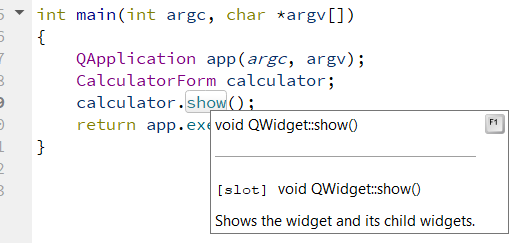
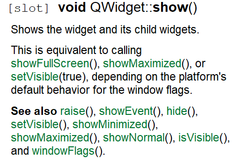
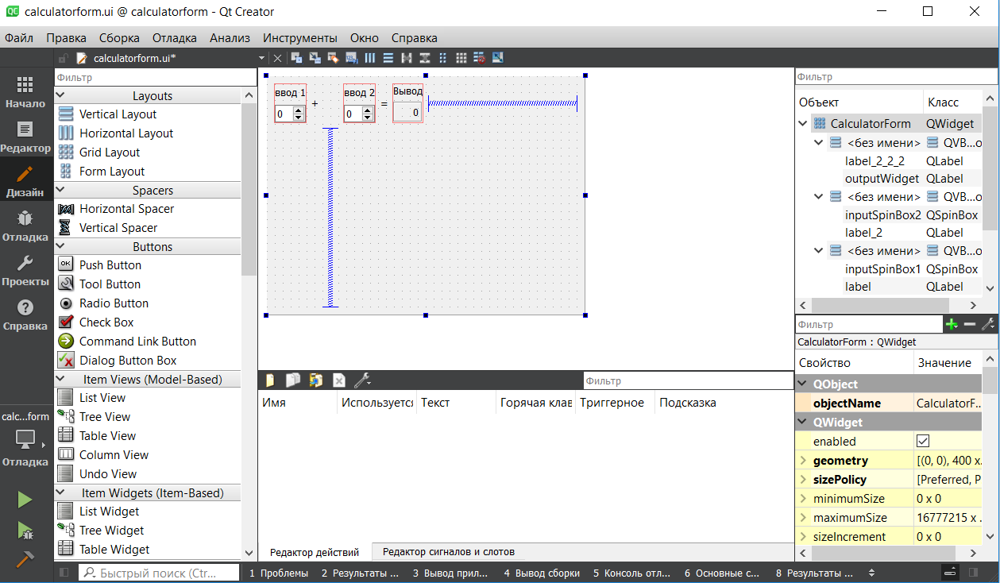

МИНИСТЕРСТВО НАУКИ  И ВЫСШЕГО ОБРАЗОВАНИЯ РОССИЙСКОЙ ФЕДЕРАЦИИ  

Федеральное государственное автономное образовательное учреждение высшего образования  

"КРЫМСКИЙ ФЕДЕРАЛЬНЫЙ УНИВЕРСИТЕТ им. В. И. ВЕРНАДСКОГО"  

ФИЗИКО-ТЕХНИЧЕСКИЙ ИНСТИТУТ  

Кафедра компьютерной инженерии и моделирования

  

​

### Отчёт по лабораторной работе № 7  по дисциплине "Программирование"

 

​

студента 1 курса группы ПИ-б-о-191(1) 

Федорова Артема Александровича

направления подготовки 09.03.04 "Программная инженерия"  

 

​

<table>

<tr><td>Научный руководитель  старший преподаватель кафедры  компьютерной инженерии и моделирования</td>

<td>(оценка)</td>

<td>Чабанов В.В.</td>

</tr>

</table>

  

​

Симферополь, 2019

<h2><b>Цель:</b></h2> 

Изучить основные возможности создания и отладки программ в IDE Qt Creator.

<h2><b>Ход работы</b></h2> 
1. Создание консольного приложения С++ в IDE Qt Creator без использования компонентов Qt

Необходимо кликнуть на "Файл" затем "Создать файл или проект" и в левой части выбрать "Проект без qt"

Рис1.Проект без qt

2. Изменение цветовой схемы qt

Чтобы поменять тему в меню нужно выбрать Инструменты- Параметры - Среда - Интерфейс-Цвет.

Рис2.Изменение цветовой схемы

3. Закомментирование/раскомментирование блока кода

Выделить блок кода и нажать Ctrl+/

4. Как открыть в проводнике Windows папку с проектом средствами Qt Creator?

В главном меню нажать на название проекта - "Показать в проводнике"

5. Какое расширение файла-проекта используется Qt Creator?

.pro

6.Как запустить код без отладки?

Нажать Ctrl+R

7.Как запустить код в режиме отладки?

Нажать на F5

8.Как установить/убрать точку останова (breakpoint)?

Кликнуть ЛКМ левее номера строчки, где надо поставить breakpoint, чтобы убрать надо кликнуть на нее еще раз

Рис3.Точка останова

9.Создал программу

Расставил точки останова в точках присваивания и вывода переменных и получил:

Рис4-6.Точки останова

В первой точке значение d - мусор, а i - 0. Такие значения они принимают так как не были инициализированы пользователем. Во второй точке i принимает значение 5, а в третьей точке d становится равно 5.

10.Закрыл проект и перешел в "Начало" -> "Примеры" 
11.Выбираю проект «Calculator Form Example».
Запускаю сборку проекта 
Навожу на функцию show() и нажимаю F1 

Рис7.Функция show()

Информация из справки

Рис8.Справка show()

В инспекторе проекта выбираю файл «Формы» => «calculatorform.ui» 
Меняю текст с английского на русский и пересобираю проект

Рис9.Изменение языка

<h2><b>Вывод</b></h2> 

Изучил основные возможности создания и отладки программ в IDE Qt Creator.

