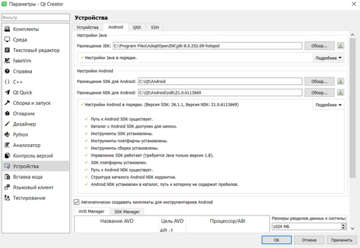
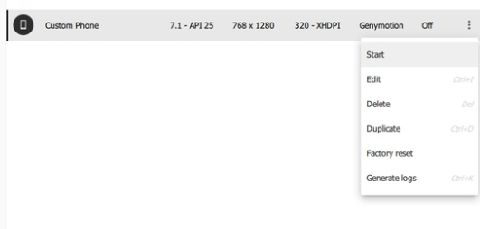
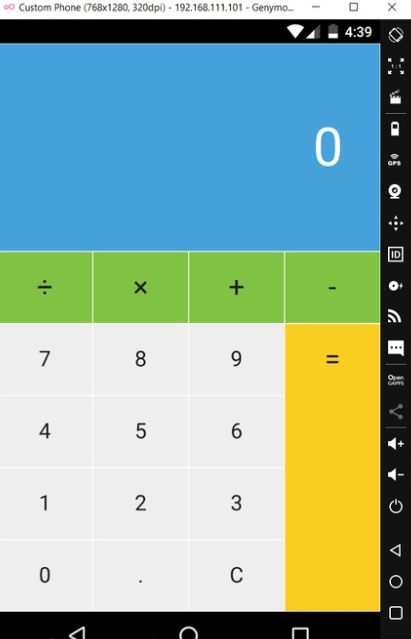

МИНИСТЕРСТВО НАУКИ  И ВЫСШЕГО ОБРАЗОВАНИЯ РОССИЙСКОЙ ФЕДЕРАЦИИ 
Федеральное государственное автономное образовательное учреждение высшего образования 
"КРЫМСКИЙ ФЕДЕРАЛЬНЫЙ УНИВЕРСИТЕТ им. В. И. ВЕРНАДСКОГО" 
ФИЗИКО-ТЕХНИЧЕСКИЙ ИНСТИТУТ 
Кафедра компьютерной инженерии и моделирования

 
<h3 align="center">Отчёт по лабораторной работе № 8  по дисциплине "Программирование"</h3>
  

студента 1 курса группы ПИ-б-о-191(1) 
Федорова Артема Александровича 
направления подготовки 09.03.04 "Программная инженерия"

  
<table>
<tr><td>Научный руководитель  старший преподаватель кафедры  компьютерной инженерии и моделирования</td>
<td>(оценка)</td>
<td>Чабанов В.В.</td>
</tr>
</table>
  

Симферополь, 2020

<h3><b>Цель:</b></h3>

1.Настроить IDE Qt Creator для разработки приложений под android ОС; 
2.Изучить базовые понятия связанные с мобильной разработкой; 
3.Научиться создавать мобильные приложения при помощи фреймворка Qt 5.14.

<h3 align="center"><b>Ход работы</b></h3>

Настроил Qt для работы с android

<i>Рис1. Настройки Qt</i>

Далее запускаю эмулятор android

<i>Рис2. Эмулятор android</i>

Запускаю проект калькулятор

<i>Рис3. Окно эмулятора</i>

<h3><b>Вывод</b></h3>

Настроил IDE Qt Creator для разработки приложений под android ОС. Изучил базовые понятия связанные с мобильной разработкой. Научился создавать мобильные приложения при помощи фреймворка Qt 5.14.

